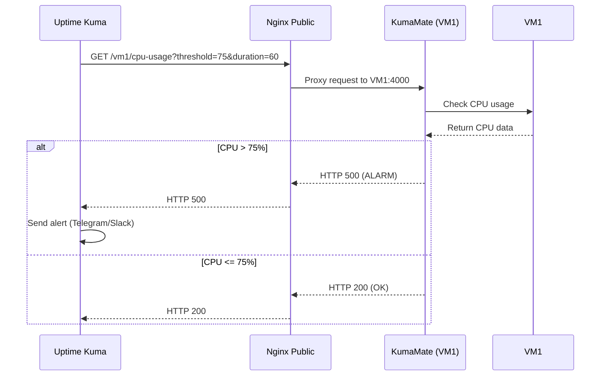

# Kuma Mate

KumaMate is a lightweight, open-source Node.js service designed to monitor CPU, memory, and storage usage on Ubuntu virtual machines (VMs), with support for macOS. It provides simple, customizable REST APIs to track system resources in real-time, making it an ideal companion for Uptime Kuma to centralize alerting and monitoring. With flexible parameters like `threshold`, `duration`, and `path`, KumaMate empowers users to define precise alerting conditions, such as triggering alarms when CPU usage exceeds 75% over 60 seconds or when the root filesystem (`/`) usage crosses 90%.

## Key Features
- **REST APIs**: Monitor CPU (`/cpu-usage`), memory (`/memory-usage`), and storage (`/storage-usage`) with HTTP status codes (200 for OK, 500 for alarms).
- **Detailed Metrics**: Includes CPU cores and speed, memory and storage used/total in GB.
- **Customizable Alerts**: Set thresholds and time durations for fine-grained monitoring (e.g., `/cpu-usage?threshold=75&duration=60`).
- **Path-Specific Storage Monitoring**: Track specific filesystems (e.g., `/storage-usage?path=/`), with macOS support for combining `/` and `/System/Volumes/Data`.
- **Lightweight & Easy to Deploy**: Built with Express.js, deployable via Git clone, `npm install`, and systemd for background execution.
- **Detailed Logging**: Logs info (operations), warnings (threshold breaches), and errors (failures) with timestamps and ANSI colors.
- **Seamless Integration**: Pairs perfectly with Uptime Kuma for centralized monitoring and notifications (Telegram, Slack, email, etc.).

## Use Case
KumaMate is perfect for DevOps engineers, system administrators, or anyone managing Ubuntu VMs who needs a simple, self-hosted monitoring solution. It shines in distributed systems, private clouds, or decentralized projects requiring efficient resource tracking.

## System Architecture
Below is a sequence diagram illustrating how KumaMate interacts with Uptime Kuma and VMs:



## Project Structure
- `data/resource-usage.json`: Stores resource samples (10 minutes).
- `src/controller/*.js`: Handles API requests.
- `src/routes/*.js`: Defines API routes.
- `src/services/*.js`: Fetches resource data.
- `utils/fileHandler.js`: Manages JSON file.
- `utils/logger.js`: Logs operations with timestamps and ANSI colors.
- `utils/resourceCollector.js`: Collects resource samples every 30 seconds.
- `src/app.js`: Initializes Express app.
- `index.js`: Runs the server on port 4000.
- `setup.sh`: Automates installation, enabling, and starting the service.

## Setup Guide
You can set up KumaMate using one of the following methods:

### Prerequisites
- Ubuntu 20.04 or later (macOS supported for local testing).
- Git installed (`sudo apt install git`).
- Internet access for downloading dependencies.
- `sudo` privileges for system operations.

### Option 1: Manual Installation
1. **Clone the Repository**
   ```bash
   git clone https://github.com/hydrabyte-co/kuma-mate.git /opt/kuma-mate
   cd /opt/kuma-mate
   ```

2. **Install Node.js**
   KumaMate requires Node.js 18.x or later. Install it if not already present:
   ```bash
   curl -fsSL https://deb.nodesource.com/setup_18.x | sudo -E bash -
   sudo apt install -y nodejs
   node -v  # Should show ~18.x
   ```

3. **Install Dependencies**
   ```bash
   npm install
   ```

4. **Set Up Systemd Service**
   Create a systemd service to run KumaMate in the background:
   ```bash
   sudo nano /etc/systemd/system/kuma-mate.service
   ```
   Add the following:
   ```ini
   [Unit]
   Description=KumaMate - VM Resource Monitoring Service
   After=network.target

   [Service]
   Type=simple
   User=uptimekuma
   WorkingDirectory=/opt/kuma-mate
   ExecStart=/usr/bin/node index.js
   Restart=always
   Environment=NODE_ENV=production

   [Install]
   WantedBy=multi-user.target
   ```
   Save and exit, then enable the service:
   ```bash
   sudo systemctl daemon-reload
   sudo systemctl enable kuma-mate
   sudo systemctl start kuma-mate
   ```
   Check status:
   ```bash
   sudo systemctl status kuma-mate
   ```
   Look for `active (running)`.

5. **Verify the Service**
   Test the APIs locally:
   ```bash
   curl "http://localhost:4000/cpu-usage?threshold=75&duration=60"
   ```
   Example output:
   ```json
   {"status":"OK","currentUsage":"20.30","avgUsage":"18.50","cores":4,"speedGHz":2.4}
   ```
   Repeat for `/memory-usage?threshold=80` and `/storage-usage?threshold=90&path=/`.

### Option 2: Automated Installation with Script
If you prefer a faster setup, use the provided `setup.sh` script to automate the process:
1. **Run the Script**
   ```bash
   chmod +x setup.sh
   sudo ./setup.sh
   ```
   The script will:
   - Check and install Node.js 18.x if not present.
   - Install dependencies.
   - Set up the systemd service.
   - Enable and start KumaMate.

2. **Verify the Service**
   After the script completes, test the APIs:
   ```bash
   curl "http://localhost:4000/cpu-usage?threshold=75&duration=60"
   ```

### Integration
- **Uptime Kuma**: Add monitors for each endpoint (e.g., `http://<vm-ip>:4000/cpu-usage?threshold=75&duration=60`) with expected status code `200`.
- **Nginx Proxy**: If using a public Nginx server, proxy requests to `http://<vm-ip>:4000` (see Nginx configuration in your setup).
- **Security**: Consider adding an API key to endpoints for authentication.

### Troubleshooting
- **Service not running**: Check logs with `sudo journalctl -u kuma-mate`.
- **Port conflict**: Ensure port 4000 is free (`sudo netstat -tuln | grep 4000`).
- **Dependency errors**: Run `npm install` again or check Node.js version.

## Credits
KumaMate was coded by **Grok**, created by xAI, based on the innovative ideas of **Tony Hoang (tonyh@hydrabyte.co)**.

## Getting Started
1. Choose an installation method from the [Setup Guide](#setup-guide) above.
2. Integrate with Uptime Kuma for monitoring.
3. Scale to multiple VMs by repeating the installation steps.

---

**License**: MIT  
**Repository**: https://github.com/hydrabyte-co/kuma-mate  
**Contact**: tonyh@hydrabyte.co